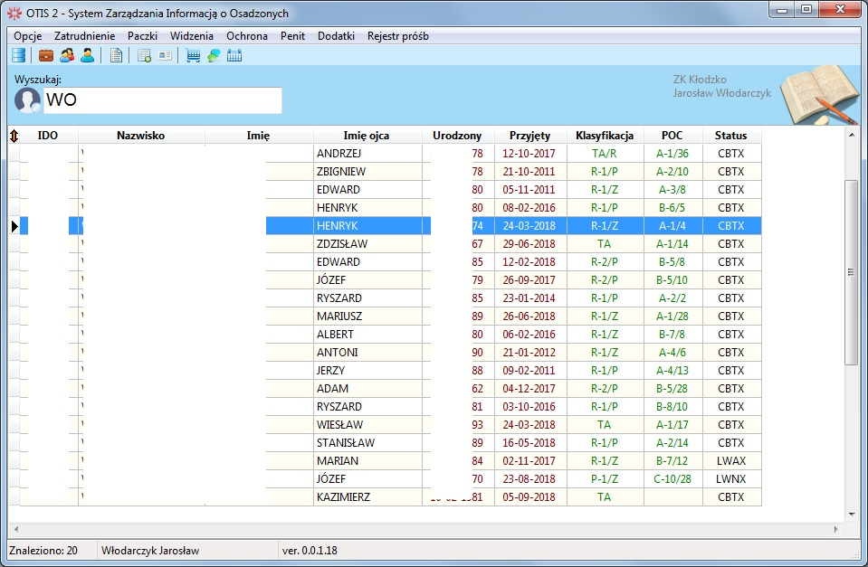
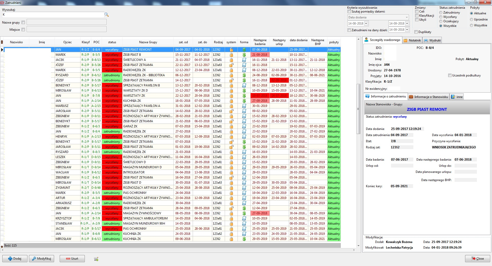
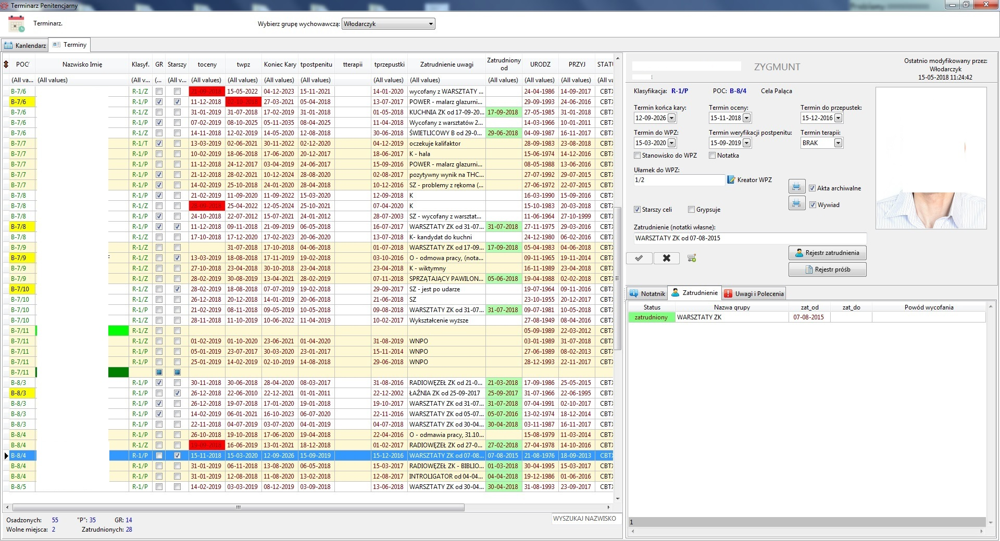
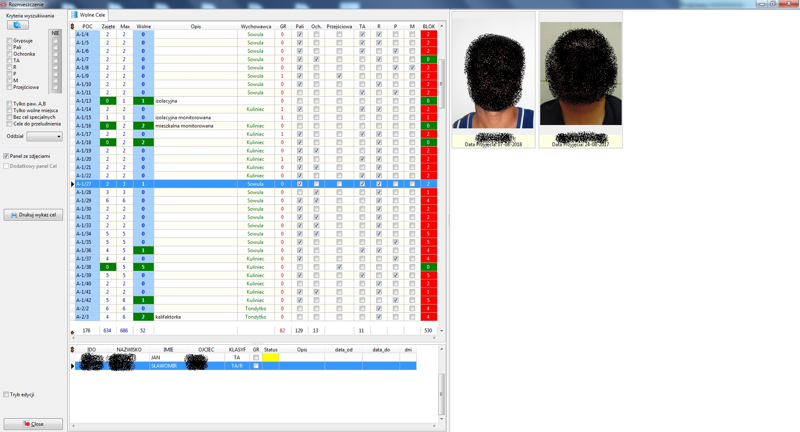

# OTIS-2

<b>Środowisko pracy:</b><br>
Typhon IDE<br>
is the Pascal Rapid Application Development tool,<br>
part of CodeTyphon Programming Studio.

<b>Wersja środowiska: 6.3</b>
--
Dodatkowy Komponent TYearPlanner: w katalogu Projekty\YearPlanner\

Program do automatycznej aktualizacji: w katalogu Projekty\Update\

Przygotowanie do pracy:
--
Utworzenie tabel w bazie danych na podstawie: Projekty\Create Table.sql<br>
Utworzenie pierwszego użytkownika i dodanie go do tabeli (uprawnienia), nadanie uprawnień administratora (Mod8 = 1).<br>
W tabeli (ver_otis2) wpisać:<br>
verP          = numer aktualnej wersji programu (potrzebne do aktualizacji) np: '0.0.1.5'<br>
path_Update   = lokalizacja programu do aktualizacji np: 'C:\OTIS2\Update.exe', może być lokalizacja w zasobach sieci.<br>
path_Foto     = lokalizacja katalogu zdjęć np: 'C:\Zasoby\ZK Foto\'<br>
path_NO_Foto  = lokalizacja zdjęcia zastępczego np: 'Raporty\kotek.jpg'<br>
Station_Name_For_Widzenia = nazwa komputera na którym realizowane są widzenia np: '153PC1600'<br>
TimerInterval = czas w msec odpytywania serwera w celu wyszukania nowych komunikatów do użytkownika.

w pliku config.ini podajemy lokalizację bazy MySQL.<br>
```
[CONFIG]
HostName=192.168.1.1
Port=3306
```
OTIS2

Zatrudnienie

Terminarz penitencjarny

Rozmieszczenie

